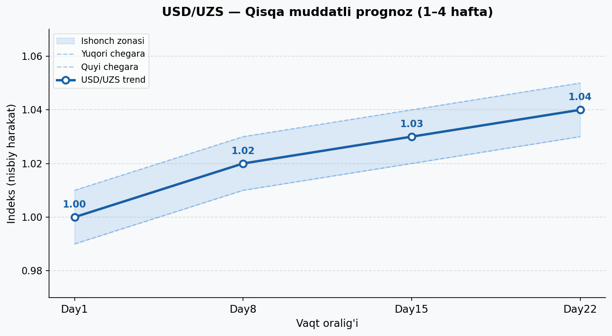

# 📈 USD/UZS AI Forecasting System

> AI-powered probabilistic exchange rate prediction platform for USD/UZS currency pair using GPT-4, LangChain, and automated chart generation.


---

## 🌐 Overview

This project is an intelligent currency forecasting system that analyzes:

- 📰 Financial news and market sentiment
- 📊 Macroeconomic indicators (inflation, GDP, interest rates)
- 🏦 Central Bank of Uzbekistan (CBU) policy decisions
- 🌍 Geopolitical events affecting the region
- 💸 Remittance flows and trade balance data
- 📈 Historical exchange rate patterns

The system outputs a **probabilistic forecast** — not exact prices — with confidence bands, making it suitable for decision support rather than automated trading.

---

## 🖼️ Sample Output



*Blue line = trend forecast | Shaded area = confidence band | Dashed lines = upper/lower bounds*

---

## 🗂️ Project Structure

```
Valuta-Analysis/
│
├── valuta-analyser.py       # Main script: LangChain + GPT-4 + chart generation
├── usd_uzs_forecast.png     # Sample output chart
├── requirements.txt         # Python dependencies
├── .env                     # Environment variable template
└── README.md                # This file
```

---

## ⚙️ How It Works

```
User Input / News Data
        ↓
System Prompt (Financial Analyst Role)
        ↓
GPT-4.1 Analysis (6-section structured output)
        ↓
Section [5] JSON extraction (regex parser)
        ↓
Matplotlib Chart (trend + confidence bands)
        ↓
usd_uzs_forecast.png saved
```

### AI Output Structure

| Section | Content |
|---------|---------|
| `[1]` 📊 Current Situation | Summary of current USD/UZS state |
| `[2]` 🔍 Key Factors | 3–6 factors with impact direction (↑↓) |
| `[3]` 📈 Short-Term Forecast | Probabilities: Up / Down / Sideways |
| `[4]` 📉 Mid-Term Outlook | 1–3 month trend + confidence level |
| `[5]` 📊 Graph Data | JSON data for automated chart rendering |
| `[6]` ⚠️ Risks | Factors that could invalidate forecast |

---

## 🚀 Quick Start

### 1. Clone the repository

```bash
git clone https://github.com/diyorbekakramov72/Valuta-Analysis.git
cd Valuta-Analysis
```

### 2. Install dependencies

```bash
pip install -r requirements.txt
```

### 3. Set up environment variables

```bash
cp .env .env
# .env faylini oching va OPENAI_API_KEY ni kiriting
```

### 4. Run the main script

```bash
python valuta_analyser.py
```

---

## 📦 Requirements

```
langchain-openai>=0.2.0
langchain-teddynote>=0.0.1
openai>=1.0.0
matplotlib>=3.7.0
numpy>=1.24.0
python-dotenv>=1.0.0
```

---

## 🔐 Environment Variables

Create a `.env` file in the root directory:

```env
OPENAI_API_KEY=your_openai_api_key_here
```

> ⚠️ **Never commit your API key to GitHub.** The `.env` file is listed in `.gitignore`.

---

## 📊 Example Forecast Output

```
[3] 📈 PROBABILISTIC FORECAST (SHORT TERM: 1–4 weeks)
- USD Up probability:   55%
- USD Down probability: 25%
- Sideways probability: 20%

[4] 📉 MID-TERM OUTLOOK (1–3 months)
- Trend: Slightly Bullish USD
- Confidence level: Medium
```

---

## 🛣️ Roadmap

- [x] GPT-4 based analysis with structured prompt
- [x] Automated JSON extraction from AI output
- [x] Matplotlib chart with confidence bands
- [ ] Real-time news feed integration (RSS/API)
- [ ] Web dashboard (Streamlit or FastAPI)
- [ ] Multi-currency support (EUR, RUB, CNY vs UZS)
- [ ] Backtesting engine
- [ ] Telegram/email alert system

---

## ⚠️ Disclaimer

This project is for **educational and research purposes only**.
It does **not** constitute financial advice.
Always consult a qualified financial advisor before making investment decisions.

---

## 📄 License

MIT License © 2025 — see [LICENSE](LICENSE) for details.

---

## 🙌 Contributing

Pull requests are welcome! For major changes, please open an issue first to discuss what you would like to change.

```bash
git checkout -b feature/your-feature-name
git commit -m "Add: your feature description"
git push origin feature/your-feature-name
```
